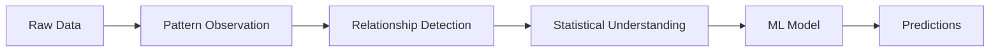
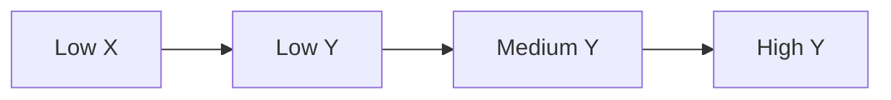
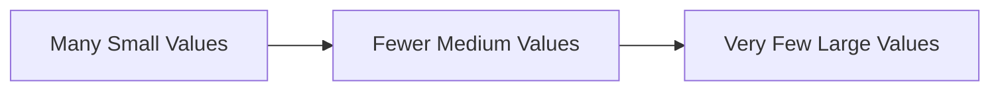
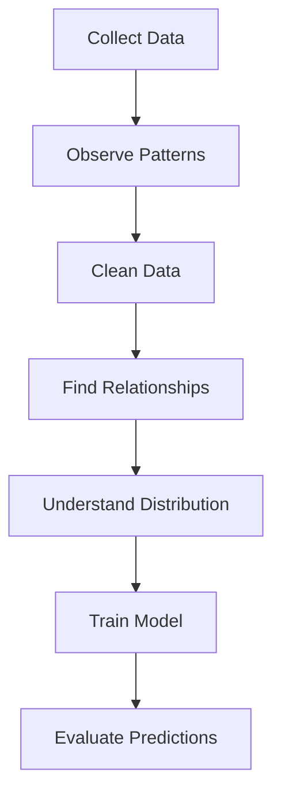
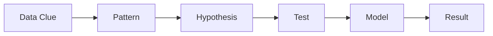
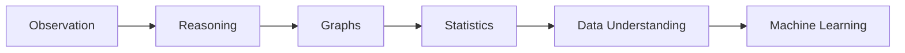

# PHASE 0 — Mindset Foundation for ML

Before you touch:

* Linear Algebra
* Calculus
* Probability
* Deep Learning

you need something far more important:

> the ability to SEE patterns.

That is what ML engineers actually do.

Not memorizing formulas.

Not writing fancy models.

Not importing libraries.

Machine Learning is fundamentally:

> observing relationships inside data.

---

# 1. What Is “Mindset Foundation” in ML?

Most beginners think ML starts with:

```python
from sklearn.linear_model import LinearRegression
```

Wrong.

That is the LAST step.

Real ML starts when you can answer:

* What pattern exists?
* What changes together?
* What stays stable?
* What is noise?
* What is signal?
* What is abnormal?
* What affects prediction?
* Which variables matter?

This is why strong ML engineers are usually strong at:

* observation
* reasoning
* graph reading
* statistics intuition
* debugging patterns

not just coding.

---

# 2. Why This Phase Is Extremely Important

Without this phase:

* graphs look confusing
* statistics feels random
* ML algorithms feel magical
* model outputs make no sense
* debugging becomes impossible

With this phase:

you start thinking like:

* a data scientist
* an analyst
* an ML engineer
* a researcher

---

# 3. Core ML Truth

ML is NOT about AI first.

ML is about:

```text
Input Data → Hidden Patterns → Predictions
```

Mermaid view:



If you skip the middle part:

* you become a copy-paste engineer
* not an actual ML engineer

---

# 4. First Principle: Learn to Observe

Suppose you see:

| Hours Studied | Exam Score |
| ------------- | ---------- |
| 1             | 30         |
| 2             | 40         |
| 3             | 52         |
| 4             | 65         |
| 5             | 78         |

Even before formulas, your brain should notice:

* more study → higher score
* variables are related
* pattern looks increasing
* relationship is not random

That observation skill is ML thinking.

---

# 5. Variables: The Heart of ML

Everything in ML is variables.

Examples:

| Variable    | Meaning         |
| ----------- | --------------- |
| Age         | Person age      |
| Salary      | Income          |
| Temperature | Weather         |
| Pixels      | Image values    |
| Words       | NLP tokens      |
| Time        | Sequential data |

ML tries to learn:

```text
How one variable affects another variable
```

---

# 6. Relationship Thinking

This is the MOST IMPORTANT mental model in ML.

Ask constantly:

* Does X affect Y?
* How strongly?
* Positively or negatively?
* Linearly or nonlinearly?
* Is it random?
* Is there a hidden factor?

Example:

| Sleep Hours | Productivity |
| ----------- | ------------ |
| 3           | Low          |
| 6           | Medium       |
| 8           | High         |

Observation:

```text
More sleep → better productivity
```

This is correlation intuition.

---

# 7. Graph Thinking (Critical)

ML engineers think visually.

A graph helps you SEE:

* trends
* patterns
* outliers
* clusters
* distributions
* anomalies

---

# 8. Understanding Trends

Example trend:



Meaning:

```text
As X increases, Y also increases
```

This becomes:

* regression
* forecasting
* predictive modeling

later in ML.

---

# 9. Outlier Thinking

Suppose:

| Salary | Experience |
| ------ | ---------- |
| 30k    | 1          |
| 40k    | 2          |
| 50k    | 3          |
| 500k   | 1          |

That `500k` is suspicious.

Your brain should ask:

* typo?
* celebrity?
* corrupted data?
* anomaly?

This is REAL ML work.

Bad data destroys models.

---

# 10. Distribution Thinking

A huge part of ML is understanding:

> how values spread.

Questions:

* Are most values small?
* Are values balanced?
* Are there extreme values?
* Is data skewed?
* Is data centered?

Example:



This is distribution intuition.

Later this becomes:

* Gaussian distribution
* skewness
* kurtosis
* normalization
* standardization

---

# 11. Pattern Recognition Mindset

Humans naturally detect patterns.

ML tries to automate this.

Examples:

| Data          | Pattern            |
| ------------- | ------------------ |
| Stock prices  | trends             |
| Images        | shapes             |
| Speech        | frequencies        |
| Text          | word relationships |
| User behavior | habits             |

---

# 12. Logical Reasoning for ML

ML engineers constantly ask:

```text
WHY did this happen?
```

Not just:

```text
WHAT happened?
```

Example:

Sales dropped.

Weak thinker:

> sales dropped.

Strong ML thinker:

* seasonal effect?
* pricing issue?
* competition?
* marketing reduced?
* data error?
* economy changed?

This reasoning skill matters more than syntax.

---

# 13. Correlation vs Causation

Critical mindset.

Suppose:

| Ice Cream Sales | Drowning Cases |
| --------------- | -------------- |
| High            | High           |

Does ice cream cause drowning?

No.

Hidden variable:

```text
Summer season
```

This is why ML engineers must think carefully.

---

# 14. Data Is Messy

Real-world data is ugly.

You will face:

* missing values
* wrong values
* duplicates
* noise
* inconsistent formats
* extreme outliers

ML is often:

```text
80% data cleaning
20% modeling
```

Beginners ignore this reality.

Industry does not.

---

# 15. Visual ML Thinking

Mermaid representation:



This is actual ML workflow thinking.

---

# 16. NumPy Mindset

NumPy teaches:

* vector thinking
* numerical operations
* matrix mindset
* efficient computation

Instead of thinking:

```python
one value at a time
```

you learn:

```python
operate on entire data together
```

This becomes essential in:

* neural networks
* tensors
* GPU computing

---

# 17. Pandas Mindset

Pandas teaches:

* table thinking
* data inspection
* filtering
* grouping
* missing value handling
* analysis mindset

Example:

```python
df.describe()
```

This gives:

* mean
* min
* max
* distribution clues

Not just numbers.

It tells a story about data.

---

# 18. EDA Mindset (Exploratory Data Analysis)

EDA means:

> investigate data before modeling.

Good engineers ALWAYS explore first.

Questions:

* What columns exist?
* Which features matter?
* Which values are missing?
* What patterns exist?
* Which features correlate?

---

# 19. ML Engineers Think Like Detectives

You are not just coding.

You are investigating data behavior.



---

# 20. Beginner Mistakes

## Mistake 1

Jumping directly into Deep Learning.

Bad idea.

Without statistics + graph intuition:

* neural networks become memorization
* not understanding

---

## Mistake 2

Memorizing formulas.

Real engineers understand:

* behavior
* meaning
* interpretation

---

## Mistake 3

Ignoring graphs.

Graphs reveal:

* model failures
* overfitting
* skewness
* bad distributions
* anomalies

---

# 21. Industry Reality

In industry:

Nobody cares if you memorized formulas.

People care if you can:

* analyze data
* debug issues
* explain patterns
* interpret graphs
* detect anomalies
* improve models

---

# 22. Mini Observation Exercise

## Dataset

| Temperature | Ice Cream Sales |
| ----------- | --------------- |
| 20          | 100             |
| 25          | 150             |
| 30          | 220             |
| 35          | 300             |

Questions:

1. What pattern exists?
2. Positive or negative relationship?
3. Is trend linear?
4. Any anomalies?
5. Which variable depends on which?

This is ML thinking practice.

---

# 23. Practical Python Example

```python
import pandas as pd
import matplotlib.pyplot as plt

# Simple dataset
data = {
    "Hours_Studied": [1, 2, 3, 4, 5],
    "Exam_Score": [30, 40, 52, 65, 78]
}

# Create dataframe
df = pd.DataFrame(data)

# Print data
print(df)

# Plot graph
plt.plot(df["Hours_Studied"], df["Exam_Score"])

# Labels
plt.xlabel("Hours Studied")
plt.ylabel("Exam Score")

# Title
plt.title("Study vs Score Relationship")

# Show graph
plt.show()
```

---

# 24. What You Should Observe From This Graph

NOT:

> nice graph.

Instead:

* upward trend
* positive relationship
* near-linear behavior
* predictable growth
* no major outliers

That is ML observation.

---

# 25. ML Connection

This exact thinking later becomes:

| Mindset Skill              | ML Concept        |
| -------------------------- | ----------------- |
| Trend observation          | Regression        |
| Group detection            | Clustering        |
| Pattern recognition        | Classification    |
| Outlier detection          | Anomaly Detection |
| Relationship analysis      | Correlation       |
| Distribution understanding | Statistics        |
| Sequential patterns        | Time Series       |
| Feature interaction        | Deep Learning     |

---

# 26. Summary Table

| Concept             | Meaning              | ML Importance     |
| ------------------- | -------------------- | ----------------- |
| Variables           | Changing values      | Core ML input     |
| Relationships       | Variable interaction | Prediction        |
| Trends              | Direction of change  | Forecasting       |
| Outliers            | Abnormal values      | Data cleaning     |
| Distribution        | Value spread         | Statistics        |
| Correlation         | Connected movement   | Feature analysis  |
| Graphs              | Visual understanding | Pattern detection |
| EDA                 | Data investigation   | Model preparation |
| Logical reasoning   | Cause analysis       | Debugging         |
| Pattern observation | Detect structure     | Core ML skill     |

---

# 27. Key Takeaways

## The biggest mindset shift:

ML is NOT:

```text
libraries + models
```

ML IS:

```text
pattern observation + statistical reasoning
```

---

## Learn to think like this:

* observe first
* question patterns
* inspect graphs
* understand relationships
* doubt suspicious data
* reason logically

---

## Your real foundation should become:



---