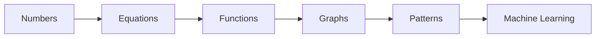
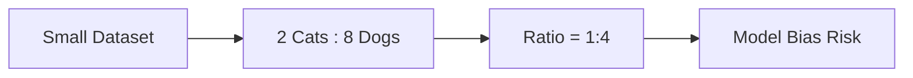
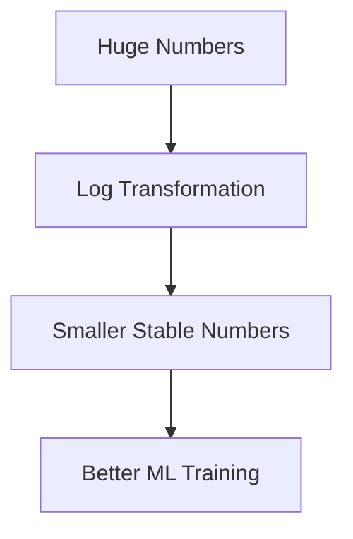
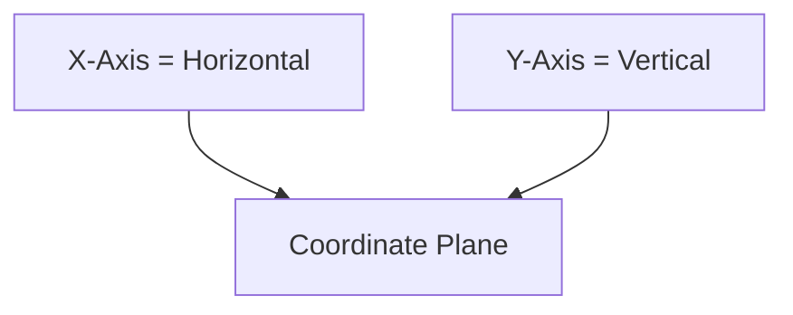
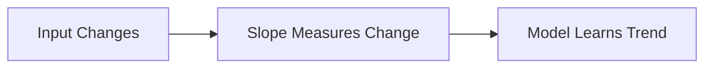
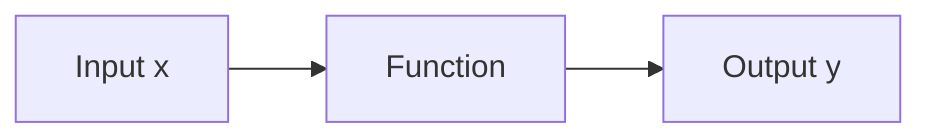
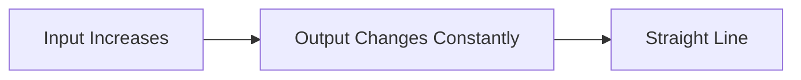
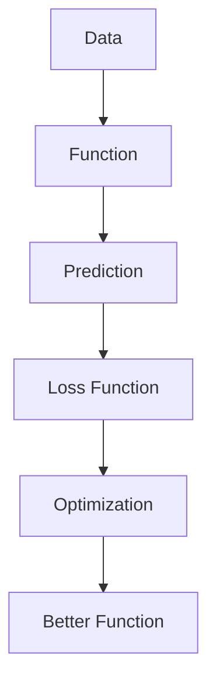

# PHASE 1 — BASIC MATHEMATICAL FOUNDATION FOR ML

This phase looks “simple” on paper, but this is where most ML learners either become dangerous engineers or permanently weak coders.

A lot of people rush into:

* neural networks
* transformers
* PyTorch
* LLMs

without understanding:

* how numbers behave
* how equations transform
* how graphs represent reality
* how functions model patterns

That creates fake understanding.

Machine Learning is fundamentally:

$$
\text{Input Data} \rightarrow \text{Function} \rightarrow \text{Prediction}
$$

So this phase is about building:

* numerical intuition
* graph intuition
* pattern intuition
* transformation thinking

---

# BIG PICTURE



---

# 1. ARITHMETIC FUNDAMENTALS

Arithmetic is not “school math”.

It is:

* data manipulation
* scaling
* normalization
* optimization
* probability computation
* loss calculation

Without fast arithmetic intuition:

* debugging becomes slow
* ML formulas become scary
* statistics becomes painful

---

# ADDITION

## Intuition

Addition combines quantities.

Example:

* 5 apples + 3 apples = 8 apples

In ML:

* total samples
* cumulative loss
* feature sums
* gradients accumulation

---

# SUBTRACTION

## Intuition

Subtraction measures difference.

ML is FULL of subtraction.

Example:

* prediction error

$$
\text{Error} = \text{Actual} - \text{Predicted}
$$

This single subtraction drives:

* gradient descent
* backpropagation
* optimization

---

# MULTIPLICATION

## Intuition

Repeated addition.

But in ML:
multiplication means:

* scaling
* weighting
* importance

Example:

$$
y = wx
$$

Where:

* $x$ = input
* $w$ = weight

This is the core of neural networks.

---

# DIVISION

## Intuition

Division normalizes or distributes.

Example:
Average:

$$
\text{Mean} = \frac{\text{Total Sum}}{\text{Count}}
$$

Used everywhere in:

* statistics
* probability
* normalization
* accuracy metrics

---

# PERCENTAGES

## Intuition

“Out of 100”

Example:

* accuracy = 92%

Formula:

$$
\text{Percentage} = \frac{\text{Part}}{\text{Total}} \times 100
$$

ML usage:

* model accuracy
* confidence scores
* dataset imbalance

---

# FRACTIONS

Fractions represent parts.

Example:

$$
\frac{1}{2}, \frac{3}{4}
$$

In probability:

$$
P(A) = \frac{\text{Favorable Outcomes}}{\text{Total Outcomes}}
$$

---

# DECIMALS

Decimals give precision.

ML models use floating-point values constantly.

Example:

* learning rate = 0.001
* probability = 0.87

---

# RATIOS

Ratios compare quantities.

Example:

* male:female = 3:2

In ML:

* class imbalance
* train:test split
* feature comparison

---

# PROPORTIONS

A proportion says two ratios are equal.

$$
\frac{a}{b} = \frac{c}{d}
$$

Important in:

* scaling
* normalization
* probability reasoning

---

# VISUAL UNDERSTANDING OF RATIOS



---

# 2. NUMBER SYSTEM

---

# POSITIVE & NEGATIVE NUMBERS

## Intuition

Positive:

* gain
* increase
* right movement

Negative:

* loss
* decrease
* left movement

ML examples:

* negative gradients
* negative weights
* negative correlation

---

# PRIME NUMBERS

A prime number has only:

* 1
* itself

Example:

* 2, 3, 5, 7, 11

Important in:

* cryptography
* hashing
* computer science foundations

---

# POWERS

Repeated multiplication.

$$
2^3 = 2 \times 2 \times 2 = 8
$$

ML relevance:

* exponential growth
* computational complexity
* polynomial features

---

# ROOTS

Inverse of powers.

$$
\sqrt{25} = 5
$$

Distance formula uses roots heavily.

---

# DISTANCE FORMULA

Very important for ML.

genui{"math_block_widget_always_prefetch_v2":{"content":"d=\sqrt{(x_2-x_1)^2+(y_2-y_1)^2}"}}

Used in:

* KNN
* clustering
* embeddings
* vector similarity

---

# LOGARITHMS BASICS

One of the MOST important ML concepts.

## Intuition

Logarithms answer:

> “How many times should we multiply?”

Example:

$$
\log_2(8) = 3
$$

Because:

$$
2^3 = 8
$$

---

# WHY ML LOVES LOGS

Logs:

* compress huge values
* stabilize training
* simplify multiplication
* power probability calculations

Used in:

* cross entropy loss
* information theory
* entropy
* likelihood

---

# LOG CURVE INTUITION



---

# 3. ALGEBRA BASICS

Algebra is the language of ML.

Without algebra:

* formulas become memorization
* optimization becomes impossible

---

# VARIABLES

Variables store unknown values.

Example:

$$
x = 5
$$

In ML:

* features
* weights
* biases
* parameters

are all variables.

---

# EXPRESSIONS

Example:

$$
3x + 2
$$

This is not solved yet.
It represents a relationship.

---

# EQUATIONS

Equation means equality.

$$
3x + 2 = 11
$$

Now solve for $x$.

---

# SOLVING EQUATIONS

Goal:
isolate the variable.

$$
3x + 2 = 11
$$

Subtract 2:

$$
3x = 9
$$

Divide by 3:

$$
x = 3
$$

---

# WHY THIS MATTERS IN ML

Training a model is basically:

> “Find values of variables that satisfy equations best.”

---

# INEQUALITIES

Instead of equality:

$$
x > 5
$$

Used in:

* decision boundaries
* thresholds
* activation logic

---

# FORMULA MANIPULATION

Critical ML skill.

Example:

$$
y = mx + b
$$

Solve for $x$:

$$
x = \frac{y-b}{m}
$$

You must become comfortable rearranging formulas.

---

# 4. COORDINATE GEOMETRY BASICS

This is where math becomes visual.

---

# X-AXIS / Y-AXIS



Every ML graph uses coordinate systems.

---

# PLOTTING POINTS

Point:

$$
(3, 5)
$$

Means:

* move 3 right
* move 5 up

---

# DISTANCE INTUITION

Distance measures similarity.

Smaller distance:

* more similar data points

Huge concept in ML.

---

# SLOPE INTUITION

Slope = rate of change.

genui{"math_block_widget_always_prefetch_v2":{"content":"m=\frac{y_2-y_1}{x_2-x_1}"}}

Interpretation:

* positive slope → increasing trend
* negative slope → decreasing trend
* zero slope → no change

---

# WHY SLOPE MATTERS

Gradient descent uses slope.

Neural networks train using slopes.

Calculus later becomes:

> advanced slope analysis

---

# SLOPE VISUALIZATION



---

# 5. FUNCTIONS BASICS (MOST IMPORTANT)

This is the HEART of ML.

---

# WHAT IS A FUNCTION?

A function maps:
input → output



Example:

$$
f(x)=2x+1
$$

If:

* $x=3$

Then:

$$
f(3)=7
$$

---

# ML INTERPRETATION

A model is just a function.

Example:

$$
\text{House Features} \rightarrow \text{Price Prediction}
$$

That mapping is a function.

---

# DOMAIN & RANGE

## Domain

Allowed inputs.

## Range

Possible outputs.

Example:

$$
f(x)=\sqrt{x}
$$

Domain:

$$
x \geq 0
$$

Range:

$$
y \geq 0
$$

---

# LINEAR FUNCTIONS

Most important starting function.

genui{"math_block_widget_always_prefetch_v2":{"content":"y=mx+b"}}

Where:

* $m$ = slope
* $b$ = intercept

---

# LINEAR FUNCTION INTUITION



Used in:

* Linear Regression
* trend prediction
* forecasting

---

# QUADRATIC FUNCTIONS

genui{"math_block_widget_always_prefetch_v2":{"content":"y=ax^2+bx+c"}}

Creates curves.

Used in:

* optimization landscapes
* physics modeling
* polynomial regression

---

# EXPONENTIAL FUNCTIONS

genui{"math_block_widget_always_prefetch_v2":{"content":"y=a^x"}}

Explodes rapidly.

Used in:

* deep learning activations
* growth modeling
* probability distributions

---

# WHY FUNCTIONS ARE EVERYTHING IN ML



This entire pipeline is machine learning.

---

# GRAPH UNDERSTANDING

You must learn to “read behavior”.

---

# LINEAR GRAPH

* constant growth
* predictable
* straight line

---

# QUADRATIC GRAPH

* curves
* turning point
* acceleration/deceleration

---

# EXPONENTIAL GRAPH

* slow beginning
* explosive growth

---

# DATA ANALYSIS THINKING

When you see data ask:

* Is trend increasing?
* Is relationship linear?
* Are there outliers?
* Is growth exponential?
* Are variables correlated?

This mindset matters more than formulas.

---

# NUMPY IMPLEMENTATION

```python
import numpy as np

# Create input values
x = np.array([1, 2, 3, 4, 5])

# Linear function
y = 2 * x + 1

print(y)
```

## Output

```python
[3 5 7 9 11]
```

## ML Relevance

This is exactly how models transform inputs into outputs.

---

# PANDAS EXAMPLE

```python
import pandas as pd

data = {
    "hours_studied": [1, 2, 3, 4, 5],
    "marks": [40, 50, 60, 70, 80]
}

df = pd.DataFrame(data)

print(df)
```

This helps visualize relationships between variables.

---

# MATPLOTLIB VISUALIZATION

```python
import matplotlib.pyplot as plt

x = [1,2,3,4,5]
y = [3,5,7,9,11]

plt.plot(x, y)

plt.xlabel("Input")
plt.ylabel("Output")

plt.title("Linear Function")

plt.show()
```

---

# ML CONNECTIONS

| Topic          | ML Usage              |
| -------------- | --------------------- |
| Addition       | Gradient accumulation |
| Subtraction    | Error calculation     |
| Multiplication | Weights               |
| Division       | Normalization         |
| Percentages    | Accuracy              |
| Ratios         | Dataset balance       |
| Powers         | Polynomial models     |
| Roots          | Distance              |
| Logarithms     | Loss functions        |
| Algebra        | Optimization          |
| Slope          | Gradient descent      |
| Functions      | ML models             |

---

# COMMON MISTAKES

| Mistake                        | Problem                     |
| ------------------------------ | --------------------------- |
| Memorizing formulas            | No intuition                |
| Ignoring graphs                | Weak pattern thinking       |
| Fear of algebra                | Cannot understand ML papers |
| Weak arithmetic                | Slow debugging              |
| Treating functions as abstract | Cannot understand models    |

---

# INTERVIEW PERSPECTIVE

Companies expect:

* graph intuition
* algebra comfort
* function understanding
* logical reasoning

Not just coding syntax.

Weak math intuition becomes obvious very quickly in ML interviews.

---

# ADVANCED CONNECTIONS

This phase later expands into:

| Current Topic | Advanced Version          |
| ------------- | ------------------------- |
| Slope         | Derivatives               |
| Distance      | Vector norms              |
| Functions     | Neural networks           |
| Equations     | Optimization              |
| Ratios        | Probability distributions |
| Logarithms    | Cross entropy             |

---

# MINI PROJECT

## Student Score Predictor

Dataset:

* hours studied
* sleep hours
* attendance
* marks

Tasks:

1. Create dataset using Pandas
2. Plot graphs
3. Observe trends
4. Identify linear relationships
5. Build intuition:

   * more study → more marks?
   * where are outliers?
   * is relationship linear?

This builds:

* graph thinking
* pattern thinking
* ML mindset

---

# FINAL SUMMARY TABLE

| Concept    | Meaning                | ML Usage         |
| ---------- | ---------------------- | ---------------- |
| Arithmetic | Basic calculations     | All computations |
| Ratios     | Comparisons            | Dataset analysis |
| Algebra    | Variable relationships | Model equations  |
| Geometry   | Spatial understanding  | Embeddings       |
| Slope      | Change measurement     | Gradient descent |
| Functions  | Input-output mapping   | ML models        |
| Logarithms | Compression/scaling    | Loss functions   |
| Distance   | Similarity measure     | Clustering/KNN   |

---

# KEY TAKEAWAYS

1. ML is built on functions.
2. Graph understanding is more important than memorization.
3. Algebra is the language of ML.
4. Slope becomes gradients later.
5. Distance becomes similarity metrics later.
6. Logarithms become loss functions later.
7. Mathematical intuition matters more than solving textbook questions fast.

---

# WHAT TO LEARN NEXT

After this phase:

## PHASE 2

You should move into:

* statistics foundations
* distributions
* probability
* graph interpretation
* data behavior

Because ML is not just math.

It is:

* math + data + patterns + optimization.
